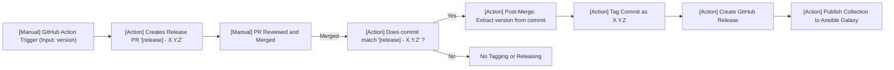

# hczv.firewall – Ansible Collection for Firewall Management

This collection provides reusable and modular Ansible roles for managing host-level and gateway/router firewalls using modern tools like nftables, designed for Linux systems.

## 📦 Roles Included
- firewall_nftables - Configure nftables with support for multi-zone setups, input/forwarding/NAT rules, dynamic set generation, and integration with tools like dnsmasq.

## ✨ Features
- Supports both **host-based** and **gateway/router** firewalling.
- Designed for **multi-host**, **multi-zone**, and **multi-layered** setups.
- Configurations can be split across **multiple YAML files** and **directory hierarchies** for readability and flexibility.
- Zero dependencies outside of core Linux packages and Ansible.

## 📁 Directory Structure
```
hczv.firewall/
├── README.md
├── roles/
│   └── firewall_nftables/
```

## 🛠 Requirements
- Ansible 2.15+ (Ansible Core)
- Python 3.7+
- Supported OS: RHEL, CentOS, Fedora, Debian, Ubuntu (systemd-based)

## 📚 Usage
Use these roles directly in your playbooks:

```yaml
- hosts: firewalls
  roles:
    - role: hczv.firewall.nftables
```

## 📖 Documentation
- [firewall_nftables](https://github.com/hczv/ansible-firewall/tree/main/roles/nftables)


## 🙏 Inspiration
This collection builds on ideas and practices from:
- [knightshrub/ansible-role-nftables-firewall](https://gitlab.com/knightshrub/ansible-role-nftables-firewall)
- [imp1sh/ansible_managemynetwork](https://github.com/imp1sh/ansible_managemynetwork/blob/main/roles/ansible_nftables/tasks/checks.yml)
- [Icebird-wall/BirdWall](https://github.com/Icebird-wall/BirdWall)
- [influxdata/ansible-collection-molecule](https://github.com/influxdata/ansible-collection-molecule/blob/main/molecule/ec2_platform/molecule.yml)


## 📦 Release Process
Releases are performed via a manual GitHub Action workflow and a release pull request:



