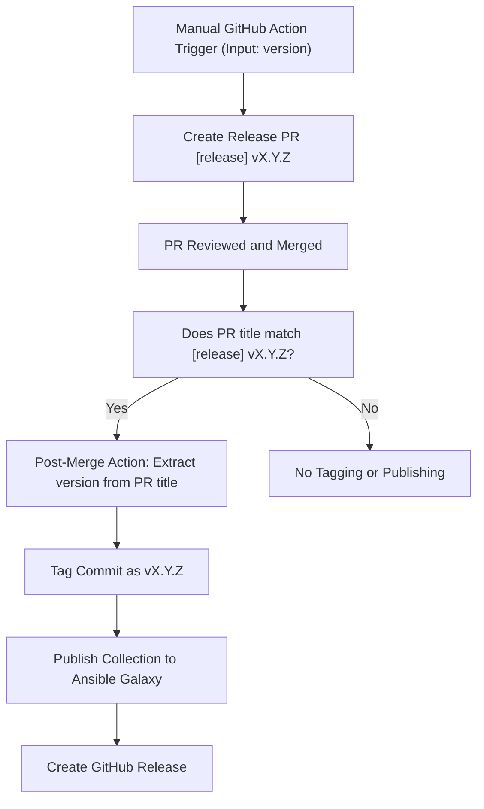

# Ansible Collection - hczv.firewall

Collection of ansible roles for managing a linux based firewall

Features:
- nftables based firewall

To-do's:
- nftables geoip filtering
- dnsmasq role
- wireguard role


# Inspiration from sources:

```
https://gitlab.com/knightshrub/ansible-role-nftables-firewall
https://github.com/imp1sh/ansible_managemynetwork/blob/main/roles/ansible_nftables/tasks/checks.yml
https://github.com/influxdata/ansible-collection-molecule/blob/main/molecule/ec2_platform/molecule.yml
https://github.com/Icebird-wall/BirdWall
```




